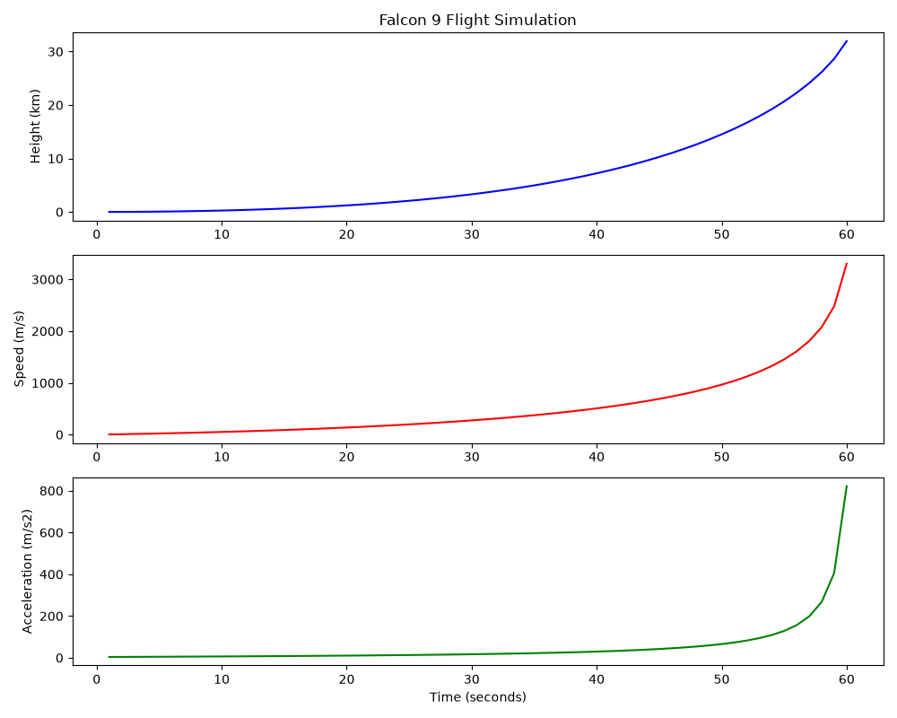

# Rocket-flight-simulator
A Python simulation of the SpaceX Falcon 9 rocket launch using real physics and engineering data.

## What it does
-Simulates Falcon 9 launch with real thrust, mass and gravity data
-Models fuel consumption and decreasing mass over time
-Calculates acceleration, speed and height every second
-Generates graphs of the full flight profile

## Physics used 
-Newton's Second Law: F = ma
-Acceleration = (Thrust / Mass) - Gravity
-As fuel burns, mass decreases -> acceleration increases

##Results
- Max height: 32 km
- Max speed: 3385 m/s
- Max acceleration: 822 m/s2

  ##Flight Graph
  

## Technologies
-Python 3
-Matplotlib

## Author
Built by Mark Khachaturyan as part of my engineering portfolio  
